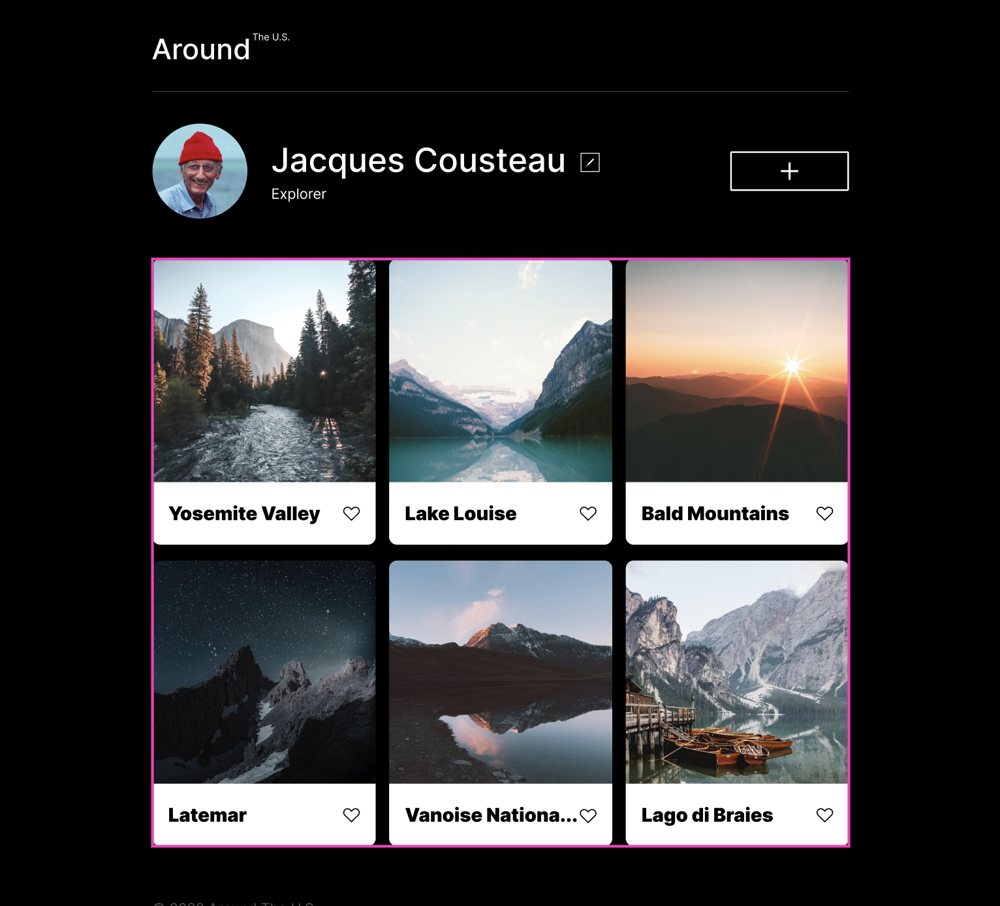

# Project 3: Around The U.S.

### Overview

Intro: This project is made to display a personal profile of Jacques Cousteau and the many places he traveled. It includes pictures of these areas, modifiable
areas for account info, name, and additional posts. This was created using HTML and CSS as of now.
 This picture is a figma mockup of the intended web page layout.

This project is made so all the elements are displayed correctly on popular screen sizes. This layout works for phones, tablets and computers of various resolutions.

**Figma**

- [Link to the project on Figma](https://www.figma.com/file/ii4xxsJ0ghevUOcssTlHZv/Sprint-3%3A-Around-the-US?node-id=0%3A1)

** VIDEO LINK HERE: https://www.loom.com/share/e7e1ef8af7e34e1083b30c1bc079d5e3 **

** Link to GitHub pages : bxadam.github.io/se_project_aroundtheus/ **
